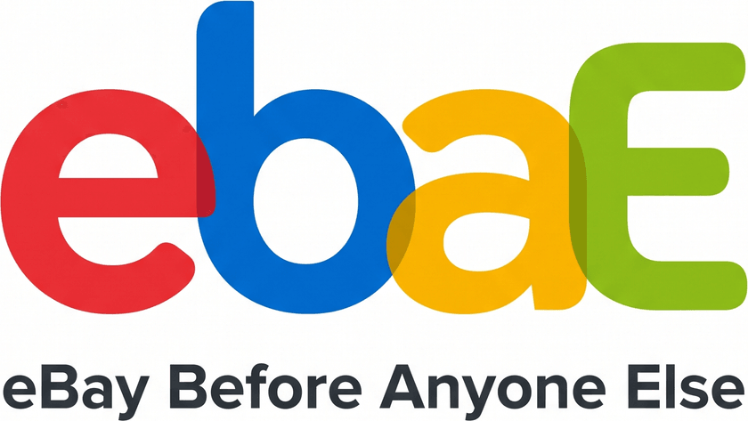

# ebae



_eBay, before anyone else._

Self-hosted eBay alerting. Polls your saved searches every 1-15 minutes via the official Browse API and pings Discord the moment a matching item lists - fast enough to catch Buy It Now drops before they're gone. One container, egress-only, nothing on your network exposed.

See [DESIGN.md](DESIGN.md) for architecture and roadmap.

## Quick start (dev)

```sh
cp .env.example .env.local   # set DATABASE_URL (Neon works great)
bun install
bun run dev
```

Open http://localhost:3000. Without eBay credentials the app runs in **mock mode**: the poller generates fake listings so you can try the whole flow (seeding, alerts, quota) before registering an eBay app.

That is the default and it needs **no new env vars**: one implicit user, no login, `DATABASE_URL` and the `EBAY_*`/`DISCORD_WEBHOOK_URL` vars are the whole config. Sharing the deployment with other people is opt-in - see [Multi-user](#multi-user).

## eBay credentials

1. Create a free account at [developer.ebay.com](https://developer.ebay.com) and create an app (production keyset).
2. Put the App ID and Cert ID in `.env.local` as `EBAY_CLIENT_ID` / `EBAY_CLIENT_SECRET`.
3. Restart. The Status & Settings page shows the token going live.

In a multi-user mode the env vars are ignored: each user enters their own App ID and Cert ID on the Status & Settings page instead, and the secret is encrypted before it is stored (see [`ENCRYPTION_KEY`](#encryption_key)). Keys are checked against eBay on save, so a typo fails immediately. Without keys a user's searches idle - the UI says so.

Browse API default quota is 5,000 calls/day per eBay app, so `EBAY_DAILY_QUOTA` is a per-user ceiling. The UI projects your daily usage as you add searches and the poller enforces the budget.

## Notifications

Alerts go to Discord webhooks, push notifications on your own devices, or both. Every target that accepts an alert gets it; an alert is retried after a restart only while no target has taken it.

### Discord

Create a webhook in your Discord channel (channel settings → Integrations → Webhooks) and set `DISCORD_WEBHOOK_URL`. More targets can be added on the Status & Settings page.

In a multi-user mode `DISCORD_WEBHOOK_URL` is ignored (it would fan everyone's alerts into one channel) - each user adds their own webhooks in the UI.

### Push

ebae is an installable PWA, so alerts can arrive as ordinary phone or desktop notifications with no Discord involved. Install it (Chrome: the address-bar install button; iPhone: Share → Add to Home Screen), open Status & Settings, and turn on **Push to this device**. It is per device - turn it on wherever you want alerts.

No configuration: the VAPID keypair is generated on first use and kept in the database. `VAPID_PUBLIC_KEY`/`VAPID_PRIVATE_KEY` override it if you would rather pin the keys, and `VAPID_SUBJECT` sets the contact URI the push services see (it defaults to this project's repo).

The toggle only appears where a browser can actually do push, which needs a **secure context**:

- **`http://localhost` counts as secure**, so push works out of the box in dev.
- **`http://<lan-ip>:3000` does not.** Browsers refuse service workers there, so no push - put ebae behind TLS, or use Discord.
- **iPhone/iPad additionally require Add to Home Screen first.** Safari tabs cannot receive push at all; the toggle appears only in the installed app.

Subscriptions expire on their own (iOS drops them after a week or two of inactivity, and Chrome revokes permission for sites you rarely open). ebae re-registers the current device every time you open it, and drops subscriptions the push service reports as gone, so this mostly takes care of itself - but if push goes quiet, opening the app is the fix.

## Configuration

Config is env vars - see [.env.example](.env.example). Searches, webhooks and (in multi-user modes) each user's eBay keys live in Postgres and are managed in the UI.

| var                                      | purpose                                                  | default                        |
| ---------------------------------------- | -------------------------------------------------------- | ------------------------------ |
| `DATABASE_URL`                           | Postgres connection string                               | required                       |
| `EBAY_CLIENT_ID` / `EBAY_CLIENT_SECRET`  | eBay app credentials (single mode only)                  | unset = mock mode              |
| `EBAY_ENV`                               | `production` or `sandbox` (single mode only)             | production                     |
| `EBAY_MARKETPLACE`                       | marketplace id (single mode only)                        | `EBAY_US`                      |
| `DISCORD_WEBHOOK_URL`                    | notification target (single mode only)                   | unset                          |
| `VAPID_PUBLIC_KEY` / `VAPID_PRIVATE_KEY` | pin the push keypair instead of generating one           | unset = generated on first use |
| `VAPID_SUBJECT`                          | `mailto:`/`https:` contact URI sent to the push services | this project's repo            |
| `AUTH_MODE`                              | `single`, `cloudflare` or `proxy`                        | `single`                       |
| `CF_ACCESS_TEAM_DOMAIN`                  | `<team>.cloudflareaccess.com` (required in `cloudflare`) | unset                          |
| `CF_ACCESS_AUD`                          | Access app Audience tag (required in `cloudflare`)       | unset                          |
| `AUTH_TRUSTED_HEADER`                    | header carrying the email (required in `proxy`)          | unset                          |
| `ENCRYPTION_KEY`                         | base64 32 bytes; encrypts eBay secrets saved in the UI   | unset                          |
| `LEGACY_OWNER_EMAIL`                     | one-time claim of pre-multi-user rows                    | unset                          |
| `POLL_INTERVAL_DEFAULT`                  | fallback poll interval (min)                             | 5                              |
| `CACHE_REFRESH_HOURS`                    | DB → cache refresh cadence                               | 12                             |
| `SEEN_RETENTION_DAYS`                    | seen_items dedupe retention (days)                       | 90                             |
| `MARKET_SAMPLE_HOURS`                    | market-baseline resample gap (band-limited searches)     | 24                             |
| `EBAY_DAILY_QUOTA`                       | enforced daily call budget, per user                     | 5000                           |
| `LOG_LEVEL`                              | `error`/`warn`/`info`/`debug`                            | `info`                         |
| `LOG_FORMAT`                             | `json` or `pretty`                                       | `pretty` on a TTY, else `json` |

Everything above the log vars except `DATABASE_URL` is optional. The single-mode-only vars are ignored in `cloudflare`/`proxy` mode (the poller warns at boot if they are set).

## Multi-user

By default (`AUTH_MODE=single`) there is no auth and one implicit user - the trust model is your LAN, your reverse proxy, your machine. **Don't expose that to the internet.** Set `AUTH_MODE` to share one deployment with other people: each gets their own searches, alerts, webhooks, snooze and eBay keys. Identity comes from an auth proxy in front of the app; ebae never handles passwords and has no signup, no roles - onboarding is done wherever your proxy keeps its allowlist.

The single-replica constraint doesn't change: poll timers and the seen-item cache are in process memory.

### `AUTH_MODE=cloudflare`

Cloudflare Access in front of a Cloudflare Tunnel. The app validates the signed `Cf-Access-Jwt-Assertion` JWT against your team's JWKS, so a request that skips Access can't forge an identity.

1. Zero Trust → Access → Applications → add a **self-hosted** application for ebae's hostname.
2. Attach your Access policy (an email include list against your IdP - Google, GitHub, whatever).
3. Copy the application's **Application Audience (AUD) Tag** → `CF_ACCESS_AUD`, and your team domain (`<team>.cloudflareaccess.com`) → `CF_ACCESS_TEAM_DOMAIN`. Boot fails if either is missing.

Onboarding a friend = adding their email to the policy. Nothing app-side; their user row is created on first login. The free Zero Trust tier covers up to 50 users. Service tokens are rejected: Access only mints an `email` claim for a real IdP login.

### `AUTH_MODE=proxy`

Generic trusted-header SSO for Authelia, authentik, oauth2-proxy, Tailscale serve and friends. Set `AUTH_TRUSTED_HEADER` to the header your proxy puts the user's email in (e.g. `Remote-Email`); that value, lowercased, is the identity.

**Only enable this when the app is reachable exclusively through that proxy.** The header is plain text and is trusted as-is - anyone who can reach the app directly can set it to any address and become that user. Bind the app to localhost or a private network, and make sure the proxy strips the header from inbound requests.

### Local development against a shared database

`AUTH_MODE=single` still runs fine against a database a multi-user mode created, but **you will see an empty account**: single mode signs you in as the implicit `local@localhost` user, while every existing row belongs to the SSO identity that created it. Nothing is lost and nothing is taken - the boot-time claim only adopts rows that have no owner - your data is simply someone else's.

Worth knowing before you point `bun run dev` at a live database: the poller is not scoped to whoever is logged in. It loads **every** user and polls **their** searches with **their** credentials, delivering to **their** webhooks. So a second poller against a shared database doubles the eBay quota spend and can double-post an alert, because the seen-item cache is per process. If the local box can't decrypt those credentials (no `ENCRYPTION_KEY`), single mode falls back to mock and posts _fake_ listings to those real webhooks.

Use a scratch `DATABASE_URL` - that's what the quick start describes, and mock mode means it needs no eBay keys at all.

If you genuinely need your real rows locally, be yourself instead of being `local@localhost`:

```sh
AUTH_MODE=proxy
AUTH_TRUSTED_HEADER=X-Email
curl -H 'X-Email: you@example.com' localhost:3000/api/searches
```

For the browser you need something to inject that header on every request. Prefer a local reverse proxy over a browser extension, and re-read the warning above about what the poller will be doing while you click around.

### `ENCRYPTION_KEY`

Needed only to save eBay credentials through the UI (encrypts the client secret at rest, AES-256-GCM). Single-mode deployments on `EBAY_CLIENT_ID`/`EBAY_CLIENT_SECRET` store nothing and don't need it.

```sh
openssl rand -base64 32
```

Keep it with your other secrets. There is no key history and no re-encryption tooling: lose it and each user re-enters their eBay keys in the UI. That is the whole recovery story, and it takes a minute.

### `LEGACY_OWNER_EMAIL`

Only for switching an **existing** single-user database to a multi-user mode. Rows created before multi-user have no owner, and the poller skips them. Set this to your email for one boot; every existing search, channel and alert is assigned to that user, and the row is adopted (`sub` stamped) when you first log in. Remove the var afterwards - the claim is idempotent, so leaving it does nothing.

Two things do not survive that upgrade, both once-off:

- **Your snooze window resets to the defaults** (off, 01:00-07:00). The old global `settings` row is dropped rather than copied, because the migration runs before your user row exists. Note your window down first and re-enter it in the UI.
- **`DISCORD_WEBHOOK_URL` stops being read**, since one global webhook would fan every user's alerts into the same channel. The claim imports it once as your own channel so notifications keep working, and logs when it does; you can drop the var afterwards. Every other user adds their webhook in the UI.

## Deploy

```sh
docker compose up -d        # uses .env; bundled Postgres available in the compose file
```

Kubernetes: `deploy/k8s.yaml` (single replica - poll timers and the seen-item cache are in-process).

Recommended setup: run it on a home box and expose the UI through a Cloudflare Tunnel behind Cloudflare Access. All app traffic is outbound-only. Add `AUTH_MODE=cloudflare` and you can share it with other people - see [Multi-user](#multi-user).
